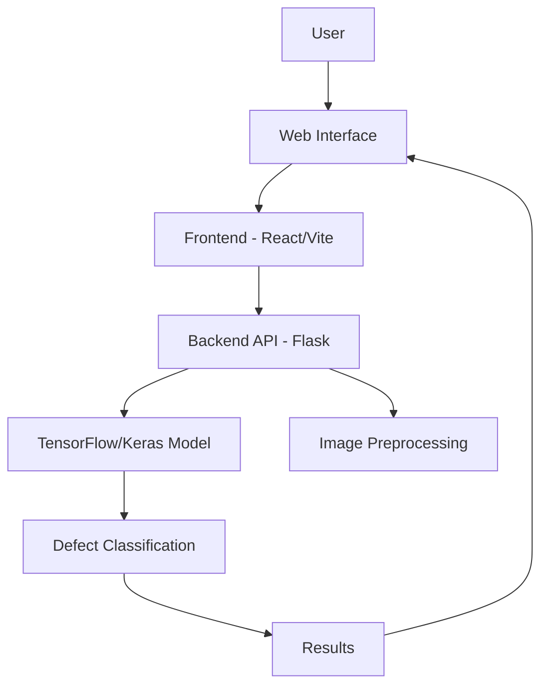
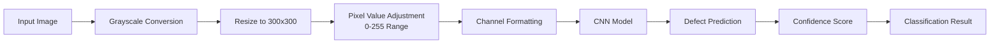
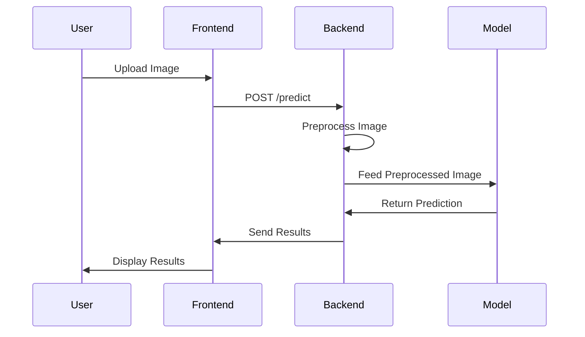
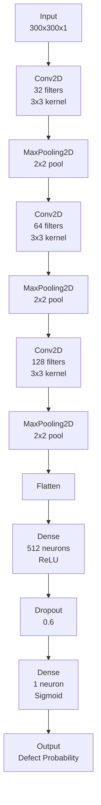
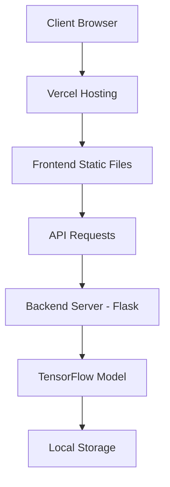

# Real-Time Casting Defect Detection Using AI/ML

## Project Overview

This project presents a real-time defect detection system for industrial casting products using advanced computer vision and machine learning techniques. The system is designed to identify defects such as porosity, cold shuts, and shrinkage in casting products during the production process, significantly reducing rework and scrap rates.

### Team Members
- **Mohit Sapat** - 31230698@vupune.ac.in
- **Sarthak Wadegaonkar** - 31230697@vupune.ac.in
- **Aditya Garud** - 31230556@vupune.ac.in

## Problem Statement

Casting defects often go undetected until final inspection, leading to:
- Increased rework costs
- Higher scrap rates
- Production delays
- Quality control inefficiencies

Current inspection methods are either manual or require expensive equipment that may not be feasible for all manufacturing setups. This project addresses these challenges by developing a low-cost, real-time defect detection system that can be easily integrated into existing manufacturing processes.

## Solution Approach

### Technology Stack
- **Frontend**: React with TypeScript, Vite, CSS3
- **Backend**: Python Flask, TensorFlow/Keras
- **Model**: Convolutional Neural Network (CNN)
- **Data Processing**: NumPy, Pillow
- **API Communication**: RESTful API with JSON
- **Build Tools**: Bun for frontend, UV for Python dependencies

### System Architecture


### Machine Learning Pipeline


### Data Flow Diagram


### Machine Learning Model
The defect detection system utilizes a Convolutional Neural Network (CNN) implemented with TensorFlow/Keras. The model was trained on the "Real-Life Industrial Dataset of Casting Product" which contains images of casting products categorized into two classes:
- `def_front` (defective)
- `ok_front` (non-defective)

#### Model Architecture
The CNN architecture consists of:
- Three convolutional layers with max pooling
- Flattening layer
- Dense layers for classification
- Dropout regularization (60%) to prevent overfitting



#### Training Parameters
- **Image Size**: 300x300 pixels (grayscale)
- **Epochs**: 64
- **Batch Size**: 64
- **Optimizer**: Adam
- **Random State**: 42

#### Performance Metrics
- **Test Accuracy**: 92.59%
- **Validation Accuracy**: Consistently high throughout training
- **Loss Function**: Binary crossentropy

## Implementation Details

### Data Preprocessing
To ensure consistency with the training pipeline:
- Images are converted to grayscale
- Resized to 300x300 pixels
- Pixel values maintained in 0-255 range (no normalization)
- Channel dimensions properly formatted for model input

### Frontend Features
- Drag-and-drop image upload interface
- Real-time defect prediction with confidence scoring
- Visual indicators for defective/non-defective classification
- Glass UI design with Voronoi shader background
- Responsive layout for desktop and mobile devices
- Backend health monitoring

### Backend API Endpoints
1. **`/predict`** (POST)
   - Accepts base64 encoded image data
   - Returns defect classification and confidence score
   - Handles image preprocessing internally

2. **`/health`** (GET)
   - System health check endpoint
   - Returns server status information

### Deployment Architecture


## Integration Capabilities

### Existing Setup Compatibility
The system can be easily integrated into existing manufacturing setups:
- Standalone web application accessible via browsers
- RESTful API for integration with existing systems
- Low computational requirements
- No specialized hardware needed

### Real-Time Processing
- Near-instantaneous defect detection
- Concurrent request handling
- Scalable architecture for high-volume production

## Benefits

### Cost Reduction
- Early defect detection reduces rework costs
- Minimizes scrap rates
- Eliminates need for expensive inspection equipment

### Quality Improvement
- Consistent defect detection standards
- Eliminates human error in visual inspection
- Immediate feedback for process adjustments

### Operational Efficiency
- Automated inspection process
- Real-time results
- Integration with existing workflows

## Technical Specifications

### Hardware Requirements
- **Frontend**: Modern web browser (Chrome, Firefox, Safari, Edge)
- **Backend**: 
  - Python 3.12+
  - 4GB+ RAM
  - 2+ CPU cores recommended

### Software Dependencies
- **Frontend**: React, TypeScript, Vite
- **Backend**: Flask, TensorFlow/Keras, NumPy, Pillow
- **Development**: Bun (frontend), UV (Python dependencies)

### Model File
- **Format**: HDF5 (.h5)
- **Size**: ~9MB
- **Location**: `CastingModel.h5`

## Installation and Setup

### Prerequisites
1. Python 3.12+
2. Bun runtime
3. UV for Python dependency management

### Backend Setup
```bash
cd backend
python3.12 -m venv venv312
source venv312/bin/activate
uv pip install -r requirements.txt
python server.py
```

### Frontend Setup
```bash
cd frontend
bun install
bun run dev
```

### Running Both Services
```bash
# From root directory
bun install
bun run dev
```

## Future Enhancements

### Model Improvements
- Integration of more sophisticated architectures (ResNet, EfficientNet)
- Transfer learning from pre-trained models
- Multi-class defect classification
- Continuous learning capabilities

### System Enhancements
- Real-time camera integration
- Batch processing for high-volume scenarios
- Enhanced reporting and analytics
- Mobile application development
- IoT sensor integration for environmental monitoring

### Deployment Options
- Edge computing deployment for low-latency requirements
- Kubernetes orchestration for enterprise-scale deployment
- Database integration for historical data analysis
- Cloud-based scaling options

## Conclusion

This real-time casting defect detection system provides an efficient, cost-effective solution for identifying defects in industrial casting products. With a 92.59% accuracy rate and a user-friendly interface, the system offers significant advantages over traditional inspection methods. The modular architecture allows for easy integration into existing manufacturing processes while providing the flexibility for future enhancements.

The combination of computer vision, machine learning, and modern web technologies creates a robust solution that addresses the critical need for early defect detection in casting production, ultimately leading to improved quality, reduced costs, and enhanced operational efficiency.

## References

1. Goodfellow, I., Bengio, Y., & Courville, A. (2016). Deep Learning. MIT Press. https://www.deeplearningbook.org/

2. LeCun, Y., Bengio, Y., & Hinton, G. (2015). Deep learning. Nature, 521(7553), 436-444.

3. Krizhevsky, A., Sutskever, I., & Hinton, G. E. (2012). ImageNet classification with deep convolutional neural networks. Advances in neural information processing systems, 25, 1097-1105.

4. Simonyan, K., & Zisserman, A. (2014). Very deep convolutional networks for large-scale image recognition. arXiv preprint arXiv:1409.1556.

5. He, K., Zhang, X., Ren, S., & Sun, J. (2016). Deep residual learning for image recognition. In Proceedings of the IEEE conference on computer vision and pattern recognition (pp. 770-778).

6. Tan, M., & Le, Q. V. (2019). EfficientNet: Rethinking model scaling for convolutional neural networks. In International Conference on Machine Learning (pp. 6105-6114).

7. Ronneberger, O., Fischer, P., & Brox, T. (2015). U-Net: Convolutional networks for biomedical image segmentation. In International Conference on Medical image computing and computer-assisted intervention (pp. 234-241).

8. Redmon, J., Divvala, S., Girshick, R., & Farhadi, A. (2016). You only look once: Unified, real-time object detection. In Proceedings of the IEEE conference on computer vision and pattern recognition (pp. 779-788).

9. Lin, T. Y., Dollár, P., Girshick, R., He, K., Hariharan, B., & Belongie, S. (2017). Feature pyramid networks for object detection. In Proceedings of the IEEE conference on computer vision and pattern recognition (pp. 2117-2125).

10. Szegedy, C., Liu, W., Jia, Y., Sermanet, P., Reed, S., Anguelov, D., ... & Rabinovich, A. (2015). Going deeper with convolutions. In Proceedings of the IEEE conference on computer vision and pattern recognition (pp. 1-9).

11. Szegedy, C., Vanhoucke, V., Ioffe, S., Shlens, J., & Wojna, Z. (2016). Rethinking the inception architecture for computer vision. In Proceedings of the IEEE conference on computer vision and pattern recognition (pp. 2818-2826).

12. Huang, G., Liu, Z., Van Der Maaten, L., & Weinberger, K. Q. (2017). Densely connected convolutional networks. In Proceedings of the IEEE conference on computer vision and pattern recognition (pp. 4700-4708).

13. Chollet, F. (2015). Keras. https://keras.io

14. Abadi, M., Agarwal, A., Barham, P., Brevdo, E., Chen, Z., Citro, C., ... & Zheng, X. (2016). TensorFlow: Large-scale machine learning on heterogeneous distributed systems. arXiv preprint arXiv:1603.04467.

15. Paszke, A., Gross, S., Massa, F., Lerer, A., Bradbury, J., Chanan, G., ... & Soumith Chintala. (2019). PyTorch: An imperative style, high-performance deep learning library. Advances in neural information processing systems, 32.

16. McKinney, W. (2010). Data structures for statistical computing in python. In Proceedings of the 9th Python in Science Conference (Vol. 445, pp. 51-56).

17. Van Rossum, G., & Drake Jr, F. L. (1995). Python reference manual. Centrum voor Wiskunde en Informatica Amsterdam.

18. Flask Documentation. (2023). https://flask.palletsprojects.com/

19. Vite Documentation. (2023). https://vitejs.dev/

20. React Documentation. (2023). https://react.dev/

21. Bengio, Y. (2000). Gradient-based learning of higher-order image features. In International Conference on Artificial Neural Networks (pp. 1-10).

22. Schmidhuber, J. (2015). Deep learning in neural networks: An overview. Neural networks, 61, 85-117.

23. Zhang, C., Bengio, S., Hardt, M., Recht, B., & Vinyals, O. (2016). Understanding deep learning requires rethinking generalization. arXiv preprint arXiv:1611.03530.

24. Hochreiter, S., & Schmidhuber, J. (1997). Long short-term memory. Neural computation, 9(8), 1735-1780.

25. Kingma, D. P., & Ba, J. (2014). Adam: A method for stochastic optimization. arXiv preprint arXiv:1412.6980.

26. Srivastava, N., Hinton, G., Krizhevsky, A., Sutskever, I., & Salakhutdinov, R. (2014). Dropout: a simple way to prevent neural networks from overfitting. The journal of machine learning research, 15(1), 1929-1958.

27. Deng, J., Dong, W., Socher, R., Li, L. J., Li, K., & Fei-Fei, L. (2009). ImageNet: A large-scale hierarchical image database. In 2009 IEEE conference on computer vision and pattern recognition (pp. 248-255).

28. Russakovsky, O., Deng, J., Su, H., Krause, J., Satheesh, S., Ma, S., ... & Fei-Fei, L. (2015). ImageNet large scale visual recognition challenge. International journal of computer vision, 115(3), 211-252.

29. Dalal, N., & Triggs, B. (2005). Histograms of oriented gradients for human detection. In 2005 IEEE computer society conference on computer vision and pattern recognition (CVPR'05) (Vol. 1, pp. 886-893).

30. Lowe, D. G. (2004). Distinctive image features from scale-invariant keypoints. International journal of computer vision, 60(2), 91-110.

31. Ojala, T., Pietikäinen, M., & Mäenpää, T. (2002). Multiresolution gray-scale and rotation invariant texture classification with local binary patterns. IEEE Transactions on pattern analysis and machine intelligence, 24(7), 971-987.

32. Viola, P., & Jones, M. (2001). Rapid object detection using a boosted cascade of simple features. In Proceedings of the 2001 IEEE computer society conference on computer vision and pattern recognition. CVPR 2001 (Vol. 1, pp. I-I).

33. Felzenszwalb, P. F., Girshick, R. B., McAllester, D., & Ramanan, D. (2010). Object detection with discriminatively trained part-based models. IEEE transactions on pattern analysis and machine intelligence, 32(9), 1627-1645.

34. Girshick, R., Donahue, J., Darrell, T., & Malik, J. (2014). Rich feature hierarchies for accurate object detection and semantic segmentation. In Proceedings of the IEEE conference on computer vision and pattern recognition (pp. 580-587).

35. Ren, S., He, K., Girshick, R., & Sun, J. (2015). Faster R-CNN: Towards real-time object detection with region proposal networks. Advances in neural information processing systems, 28.