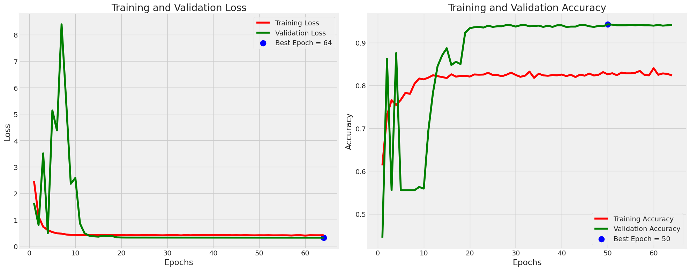
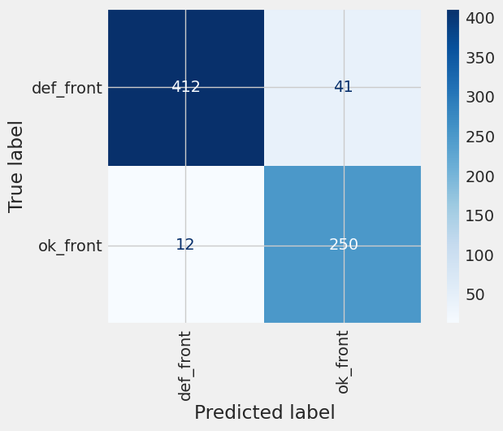
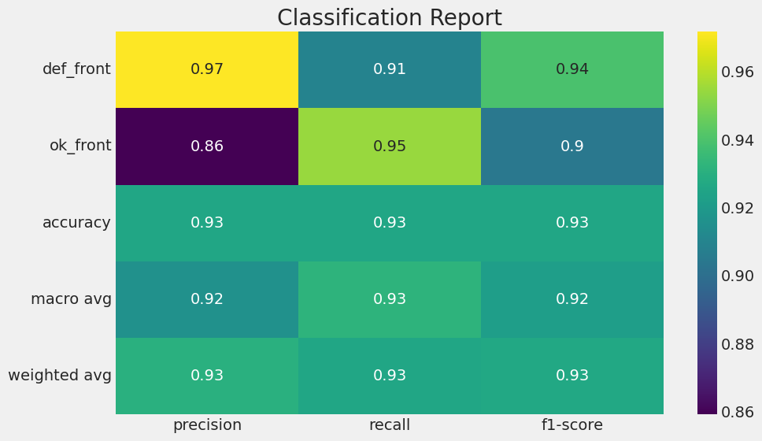
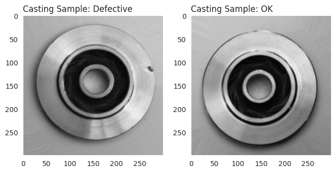

# Casting Defect Detection System

## Setup Instructions

### Prerequisites
- Bun (for frontend)
- Python 3.12 (for backend)
- UV (for Python dependency management)

### Backend Setup
```bash
cd backend
# Create virtual environment
/opt/homebrew/opt/python@3.12/bin/python3.12 -m venv venv312

# Activate virtual environment
source venv312/bin/activate

# Install dependencies
uv pip install flask flask-cors tensorflow numpy Pillow requests

# Start server
python server.py
```

### Frontend Setup
```bash
cd frontend
# Install dependencies
bun install

# Start development server
bun run dev
```

### Running Both Services
```bash
# From project root
bun run dev
```

This will start:
- Frontend development server on http://localhost:3000
- Backend API server on http://localhost:5001

## API Endpoints

- `GET /health` - Health check endpoint
- `POST /predict` - Analyze an image for defects

## Model Performance

The model achieved a test accuracy of 92.59% on the casting product dataset.

### Training Accuracy


### Confusion Matrix


### Classification Report


### Sample Output


## Model Information

- **Input Size**: 300x300 grayscale images
- **Classes**: Defective (def_front) and Non-defective (ok_front)
- **Test Accuracy**: 92.59%
- **Framework**: TensorFlow/Keras

## Design Principles

### Visual Design
- **Minimalist Aesthetics**: Clean black and white color scheme
- **Paper Shaders**: Subtle textures for depth and realism
- **Typography**: Clear, readable fonts with proper hierarchy
- **Icons**: Simple SVG icons with consistent stroke weights

### User Experience
- **Intuitive Workflow**: Simple 3-step process (Upload → Analyze → View Results)
- **Immediate Feedback**: Loading states and error handling
- **Accessibility**: Proper contrast ratios and semantic HTML
- **Performance**: Optimized image handling and fast responses

## Project Structure

```
frontend/
├── src/
│   ├── api/              # API service layer
│   ├── assets/           # Static assets
│   ├── components/       # React components
│   ├── utils/            # Utility functions
│   ├── App.tsx           # Main application component
│   ├── main.tsx          # Entry point
│   └── index.css         # Global styles
├── index.html            # HTML template
├── package.json          # Dependencies and scripts
└── vite.config.ts        # Vite configuration

backend/
├── server.py             # Flask application
├── requirements.txt      # Python dependencies
└── venv312/              # Virtual environment
```

## Testing

### Backend Testing
```bash
cd backend
source venv312/bin/activate
python test_model.py
python test_api.py
```

## Deployment

### Building Frontend
```bash
cd frontend
bun run build
```

The built files will be in the `dist/` directory.

## Contributing

1. Fork the repository
2. Create a feature branch
3. Commit your changes
4. Push to the branch
5. Create a pull request

## License

This project is licensed under the MIT License.

## Author

Aditya Garud
- Portfolio: https://aditya-garud.me/
- GitHub: https://github.com/yashranaway